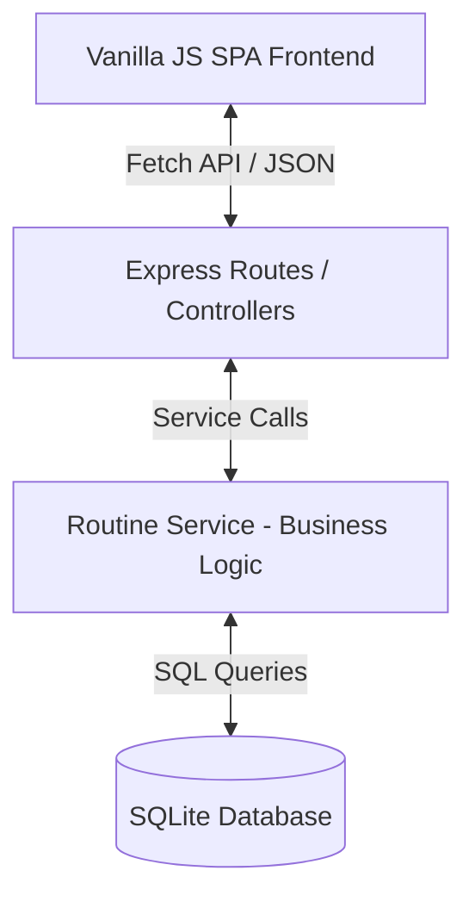
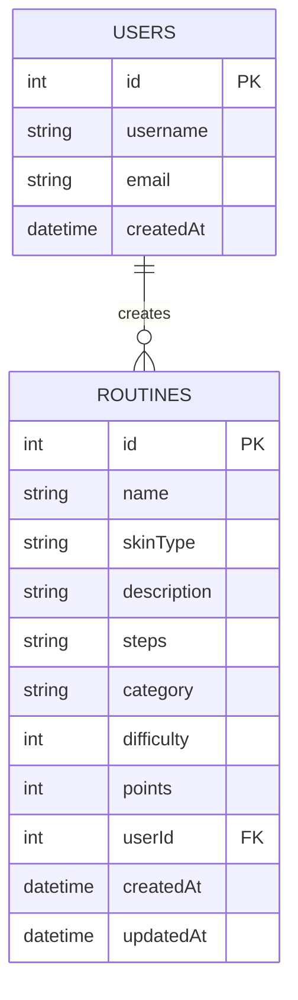

# 🧴 SkinBook - Skincare Knowledge Base & Routines Manager

SkinBook is a comprehensive, full-stack web application designed as a personal and social skincare routine knowledge base. It allows users to learn about skin ingredients, share routines, filter by skin types, and search for tailored routines.

This project is developed in accordance with the **System Analysis and Design (Spring 2026)** course requirements.

---

## 🏗️ System Architecture & Modularity

The application is built on a modular **Model-Service-Controller (MVC-like)** architecture that strictly decouples the user interface, routing logic, and database operations to ensure high code quality, testability, and clean separation of concerns.



*   **Frontend (SPA):** Built using **Vanilla JavaScript** (no frameworks), CSS, and HTML. Communicates asynchronously with the backend using the `fetch` API, enabling a Single Page Application experience with zero full-page reloads.
*   **Backend (REST API):** Developed using **Node.js** and **Express.js**, serving standard REST endpoints with appropriate HTTP status codes.
*   **Business Logic (Services):** Housed separately in the `src/services` directory (e.g., `RoutineService.js`), ensuring no business logic is mixed within the routes.
*   **Data Layer (SQLite):** Managed via a wrapper promise database class, executing efficient SQL transactions.

---

## 📊 Relational Database Schema

To satisfy the academic requirement for relational complexity, the data model incorporates a **One-to-Many Relationship** between **Users** and **Routines**.



*   **Relationship:** A **User** can create multiple **Routines** (`One-to-Many`).
*   **Foreign Key Constraint:** `routines.userId` references `users.id` with a default fallback to ensure smooth compatibility and integrity.

---

## 🚀 Quick Start & Installation

### Prerequisites
*   Node.js (v16.0.0 or higher recommended)
*   npm

### Installation Steps
1.  **Install dependencies:**
    ```bash
    npm install
    ```

2.  **Configure environment variables:**
    Create a `.env` file in the root directory (already supplied):
    ```env
    PORT=3000
    ```

3.  **Run the application (Development mode):**
    ```bash
    npm run dev
    ```

4.  **Access the application:**
    *   **Frontend SPA:** http://localhost:3000
    *   **Interactive Swagger API Docs:** http://localhost:3000/api-docs

---

## 📚 API Endpoints & Documentation

SkinBook features fully interactive **Swagger/OpenAPI** documentation. You can test and explore all endpoints interactively by navigating to `http://localhost:3000/api-docs` while the server is running.

| Method | Endpoint | Description | Input / Payload |
| :--- | :--- | :--- | :--- |
| **GET** | `/api/routines` | Get all routines (Supports query filters) | `skinType`, `category`, `search` |
| **GET** | `/api/routines/:id` | Get specific routine by ID | Path parameter `id` |
| **GET** | `/api/routines/search/:term` | Search routines by term | Path parameter `term` |
| **POST** | `/api/routines` | Create a new skincare routine | JSON containing routine properties |
| **PUT** | `/api/routines/:id` | Update an existing skincare routine | JSON with updated properties |
| **DELETE** | `/api/routines/:id` | Delete a routine by ID | Path parameter `id` |

---

## 🧪 Unit Testing

We have achieved **100% Test Coverage** on our business logic using **Jest**.

*   **Test Location:** `src/services/routineService.test.js`
*   **Covered Scenarios:**
    *   Input Validation: name constraints, skin type checks, difficulty limits, positive points.
    *   CRUD Operations: Database insert simulation, filtered fetching, specific ID retrieval, SQL update updates, record deletion.

### Run Tests
To execute the automated unit tests, run:
```bash
npm test
```

---

## 🔒 Input Validation

The system enforces strict input validation at both layers:
1.  **Frontend Validation (`public/app.js`):** Intercepts form submissions to check name length (min 3, max 100), required skin types, and difficulty boundary limits, showing instant toast alerts in case of violation.
2.  **Backend Validation (`src/services/routineService.js`):** Re-validates data before passing to SQL database layers, rejecting invalid transactions with clear `400 Bad Request` responses.